# Renderscript
## for Fun and Profit

^Hello everyone, My name is Etienne Caron.

^Today I'll be introducing you to Renderscript, and it's potential uses in your Android application. Renderscript is a framework that allows you to execute computationally intensive tasks on Android. 

---

# Data-parallel computation...
## Whatnow??

^ Renderscript is primarily designed for data-parallel computation. People new to programming often ask me "what does this even mean?" And I like to point them to...

---

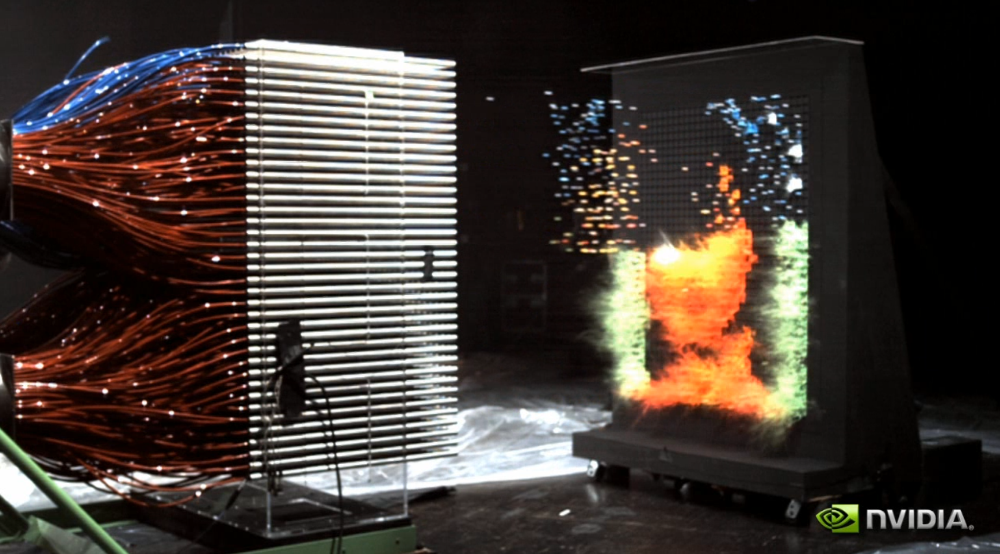

^...this massive paintball cannon the MythBusters built for an NVidia event, in 2008. It compared sequential and parallel processing. Think of each paintball gun as a program running in a separate thread.

--- 
# Parallel = Speed
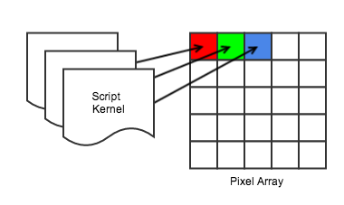

^Each of these programs, or "script kernels", are fired/executed to compute the pixel color-values of your image. This parallel processing is what allows you to leverage the multiple **DSP and GPU** cores found on modern Android devices.

--- 

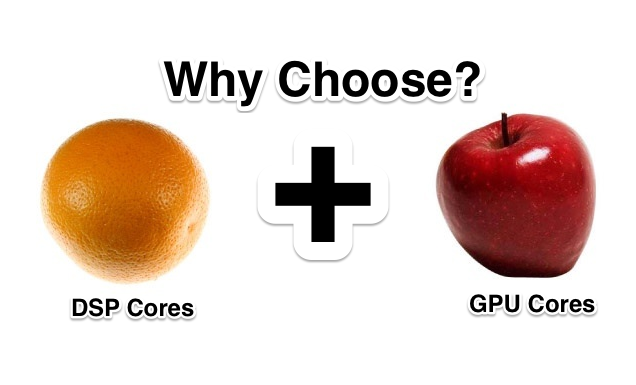

^ [1 min mark] Here people sometime look at me, puzzled, and say "DSP **and** GPU cores?" Why yes! Exactly! Renderscript, unlike other approaches, promises to leverage the hardware available on that **specific** device.

---

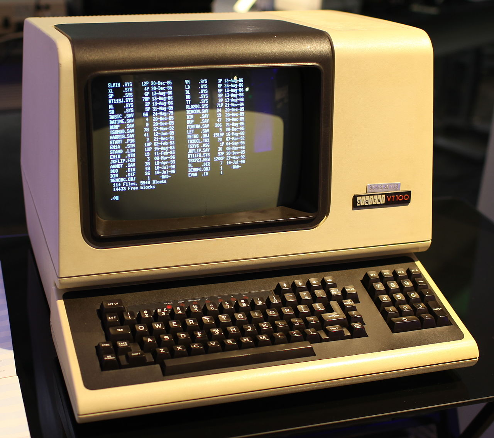
# Ugh, now I have to learn C, right?
^Well, you 'can' avoid it. By using implementations of the ScriptIntrinsic class, it's possible to bypass all that scary C code. 

--- 
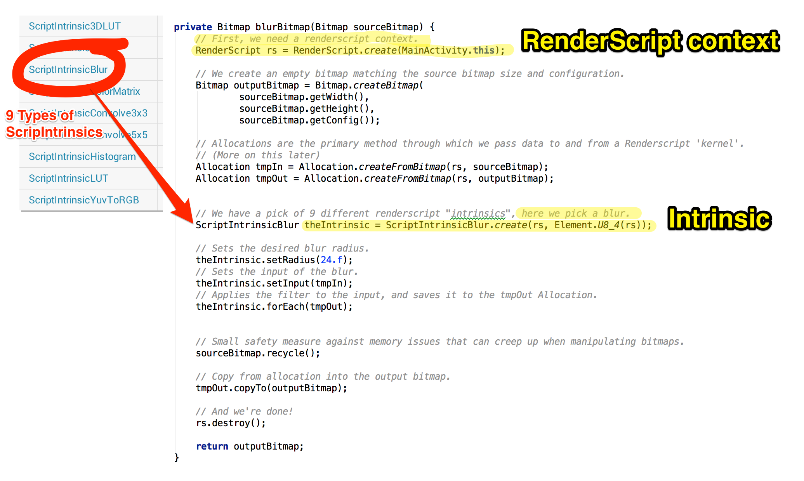

^At time of writing, we can pick from 9 different Intrinsic implementations. For our example, we'll blur a bitmap. We need a renderscript context, and we must instantiate our intrinsic.

---
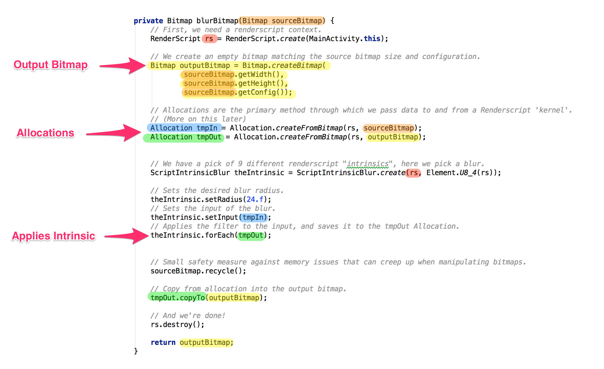

^Note that, our input usually is 'immutable', that's why we create an identical, 'mutable' output bitmap. Allocations are built based on these 2 bitmaps. Allocations pass data to and from a renderscript kernel.

---

^[2 min mark] And we can see the result here. Great. Some of you might say "If I'm not actively 'afraid' of C, what else could I do?" Well, you can create custom Renderscript kernels.

---
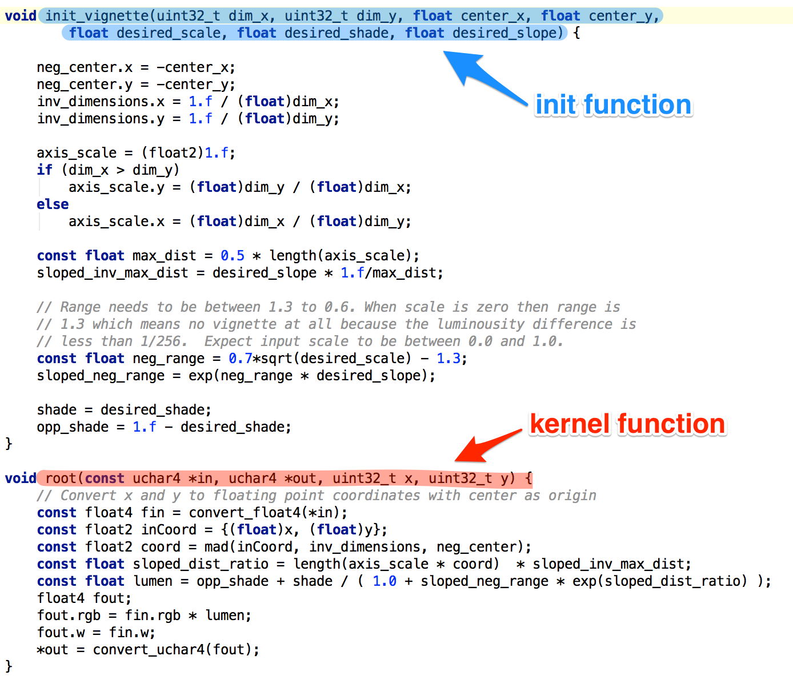
# C99 language 
## [.rs files]
`<project>/src/main/rs/*.rs`

^Kernels are written in a C99-derived language. They are usually stored in a `.rs` file under `/src/main/rs`. You can have multiple kernels per `.rs` script.

---
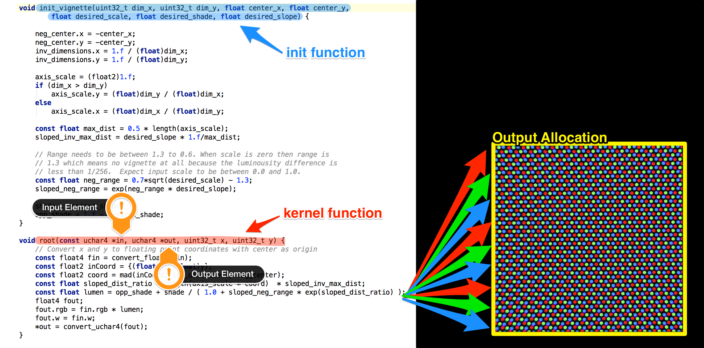

^Note that Kernels look similar to standard C functions, but they run in 'parallel', across every 'Element' (here pixels) in an 'Allocation'. A kernel can have an input and/or an output 'Allocation'. 

---
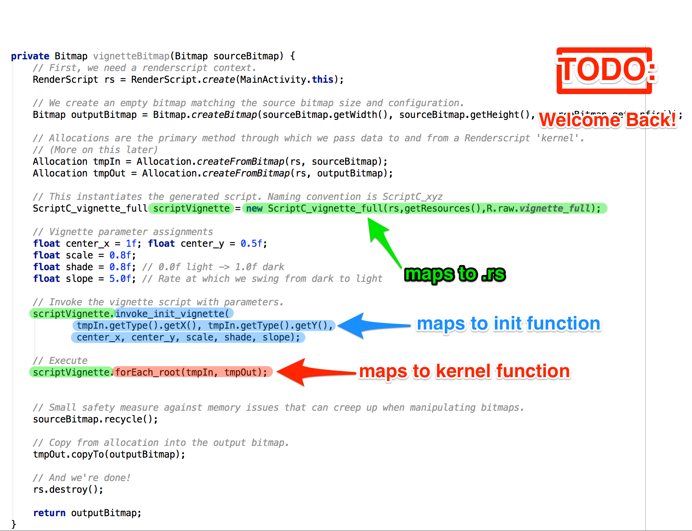

^Here's the java call to the script, the setup is nearly identical to the previous Java example, and note how we pass parameters to control the vignette effect. These are based off the C99 code.

---

# Vignette
[on yellow background for emphasis]

^[3 min mark] Efficient photo processing, nice! What else? Ultimately, the key to finding interesting uses for Renderscript is to come up with problems that can be solved in parallel. Conway's Game of Life is a good example.

---

# Game of Life 

1. Neighbours < 2
	- Death
2. Neighbours 2 | 3
	- Lives
3. Neighbours > 3
	- Death
4. Neighbours == 3
	- Birth

^In the Game of Life, you start with a grid. Each cells is "alive" or "dead". A cell is born, lives or dies depending on the current amount of immediate neighbors. 

---
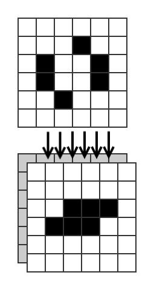

# Parallel Computation

We depend only on current state of system, not neighboring cell's computation result.

^This kind of problem lends itself wonderfully to parallel processing. The programs in each cell depends on the **current state of the system**, and because of this, they can run simultaneoulsy.

---
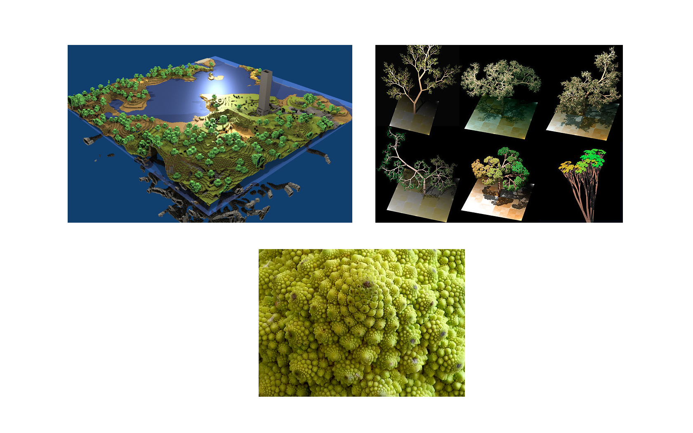

^Procedural Content Generation and Physics Simulations also fit the bill. Some of today's most popular games leverage these techniques with great effect. (Landscape generation, Fractals, model trees using L-systems, Fluid dynamics, etc.)

---

# Metal Mania
^[4 min mark] When I first heard about 'Metal' for iOS, and the supposed performance gained from dropping the OpenGL pipeline, going straight to GPUs...

---

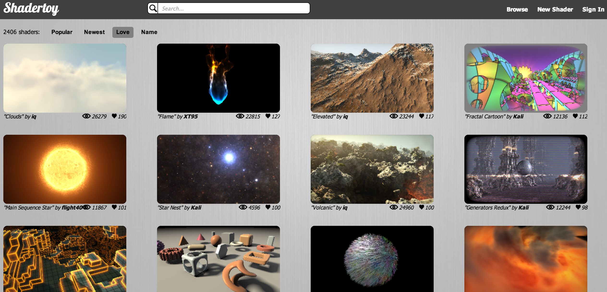

## Raw Power

^I wasn't actually so surprised. You're looking here at 'raw' GPU rendering. All these effects are accomplished by a **shader programs only**, with minimal OpenGL pipeline configuration. It's an approach conceptually similar to using Renderscript Kernels.

---

# Small Footprint

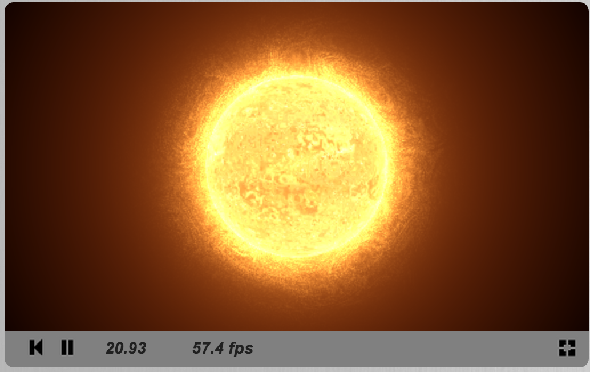
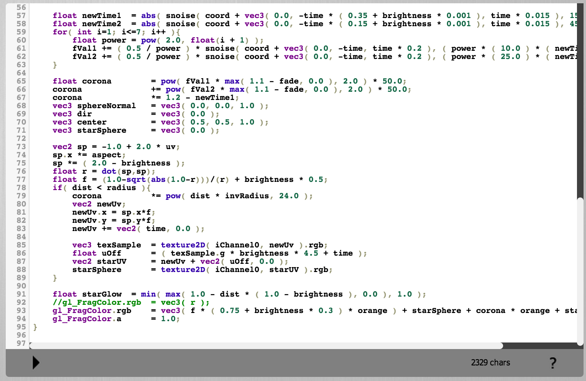

^If you look at the shader source code on the right hand side, this specific example is only 95 lines long! Instead of feeding complex geometry to OpenGL, it is computed. We're actually looking at an animated texture on 2 triangles filling the screen.

---

# Thank You!

^This is all for me. If you're interested to learn more, quick, follow this QR-Code! You'll land on a github project with the slides and a simple starter Renderscript project. You'll also find links to most of what was outlined above. 

^Thank you.

